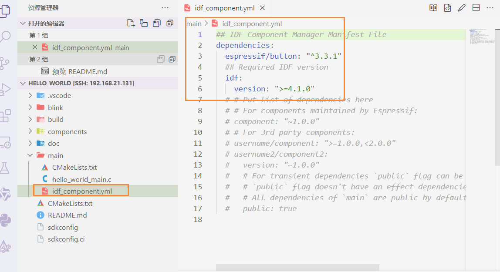

# 工程构建

自定义外部组件库的位置:(通过该方式就能够实现项目结构的控制)

`最顶层的CMakeLists.txt`

``` c
# 设置额外的组件搜索路径
set(EXTRA_COMPONENT_DIRS
    ./blink
)
```


遇到重名组件components中最后会会覆盖

到这里位置都是手动添加组件库的方式

# idf 组件库(官方组件库)

地址:
https://components.espressif.com/

自动添加到

1. 搜索组件 


2. 注意组件依赖的idf版本


3. 打开项目,导入组件


``` bash
idf.py add-dependency "espressif/button^3.3.1"
```

执行命令之后, 会在项目下看到`.yml`文件



接下来执行
``` bash
idf.py build
```

idf会去下载刚添加的组件并build, 这个lock文件是防止该组件中的内容被修改


# 生成默认配置(sdkconfig)

运行该指令会生成 一个sdkconfig.default 配置文件, 这样在构建项目就不用一个一个去配置了

``` bash
idf.py save-defconfig
```

# 项目较大时注意调整flash分区表

# main组件中的其他文件夹


# 编程要点

``` c
// 成对使用, 且顺序一定!!!
// 成对使用, 且顺序一定!!!
// 成对使用, 且顺序一定!!!
#include "freertos/FreeRTOS.h"
#include "freertos/task.h"
```


# managed_components

这个文件看起来还是很不整洁, 于是将官方的组件也手动移植到`components`目录下

手动管理官方的组件.

1. 修改要点

修改`idf_component.yml`管理文件,只保留idf的版本管理, 其他注释掉即可.


# 参考视频

推荐!!!!!
推荐!!!!!
推荐!!!!!

【入门 ESP-IDF 工程结构【新手超详细教程】】 https://www.bilibili.com/video/BV18keGeaEhE/?share_source=copy_web&vd_source=4c2fae4727363558be69d7a47f51e6cf

【esp32-idf学习中资料的获取 （前置一）】 https://www.bilibili.com/video/BV1Ut421L7U3/?share_source=copy_web&vd_source=4c2fae4727363558be69d7a47f51e6cf

【esp32-idf idf_component组件管理器使用分享 （前置二）】 https://www.bilibili.com/video/BV1kt421L7UK/?share_source=copy_web&vd_source=4c2fae4727363558be69d7a47f51e6cf

【【2024最新版 ESP32教程（基于ESP-IDF）】ESP32入门级开发课程 更新中 中文字幕】 https://www.bilibili.com/video/BV1eRg7exEcT/?p=2&share_source=copy_web&vd_source=4c2fae4727363558be69d7a47f51e6cf